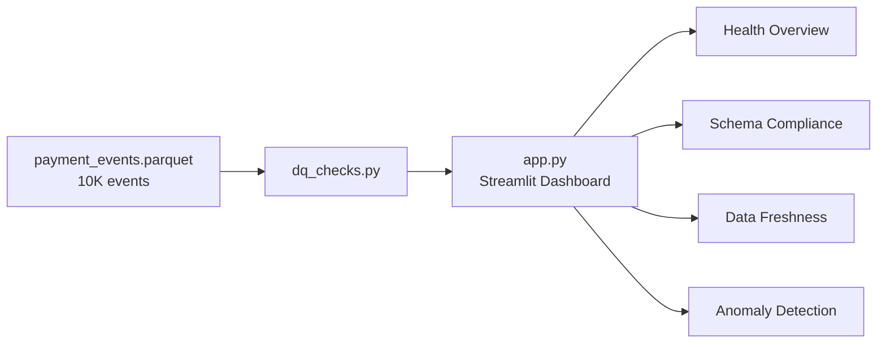

# Mal Data Quality Monitor

An [Elementary](https://www.elementary-data.com/)-inspired data quality monitoring dashboard for the Mal Unified Payment Data Platform. Tracks schema compliance, data freshness, and anomaly detection across 3 product squads (Cards, Transfers, Bill Payments).

> **Parent project:** [mal-cross-product-data-platform](https://github.com/mhassan-k/mal-cross-product-data-platform)

---

## Tech Stack

| Technology | Role |
|------------|------|
| [**Streamlit**](https://docs.streamlit.io/) | Interactive dashboard UI |
| [**DuckDB**](https://duckdb.org/) | In-memory Parquet analytics |
| [**Pandas**](https://pandas.pydata.org/) | Data manipulation & checks |
| [**NumPy**](https://numpy.org/) | Z-score anomaly detection |

---

## Architecture



---

## Dashboard Pages

### 1. Health Overview
- Overall health score (0-100) with RAG color coding
- 4 dimension pillars: Schema Compliance, Freshness, Completeness, Volume Stability
- Per-source cards: records count, compliance %, freshness status, null rate

### 2. Schema Compliance
- 13 validation rules (non-null checks, enum validation, ISO currency, amount range)
- Per-source compliance rate with failure counts
- Compliance trend over time
- Expandable per-source rule breakdown

### 3. Data Freshness
- Time since last event per source system
- RAG thresholds: green (< 24h), yellow (1-7 days), red (> 7 days)
- Event timeline chart by source
- Staleness detail table

### 4. Anomaly Detection
- Daily volume anomalies via rolling 7-day z-scores (threshold: 2.0)
- Volume trend charts with rolling mean overlay
- Null rate heatmap (source x column)
- Amount distribution stats per source

---

## Quick Start

```bash
# 1. Clone the repo
git clone https://github.com/mhassan-k/mal-data-platform-DQ.git
cd mal-data-platform-DQ

# 2. Install dependencies
pip install -r requirements.txt

# 3. Run the dashboard
streamlit run app.py
# Opens at http://localhost:8501
```

---

## Deploy to Streamlit Cloud

1. Push this repo to GitHub
2. Go to [share.streamlit.io](https://share.streamlit.io)
3. Select the repo and set `app.py` as the main file
4. Deploy -- the dashboard reads `data/payment_events.parquet` on startup

---

## Project Structure

```
mal-data-platform-DQ/
├── app.py                # Streamlit dashboard (4 pages)
├── dq_checks.py          # Core DQ check functions
├── requirements.txt      # Python dependencies
├── .gitignore
├── data/
│   └── payment_events.parquet  # 10K unified payment events
└── README.md
```

---

## DQ Check Functions (`dq_checks.py`)

| Function | Purpose |
|----------|---------|
| `check_schema_compliance(df)` | Validates required fields, enums, currency format, amount range |
| `compliance_by_source(df)` | Aggregates compliance rate per source system |
| `check_freshness(df)` | Computes time since last event per source |
| `check_volume_anomalies(df)` | Rolling z-score detection on daily event counts |
| `check_null_rates(df)` | Null rate per column per source system |
| `compute_health_score(df)` | Weighted health score (0-100) with RAG dimensions |

---

## Health Score Methodology

The overall score is a weighted average of 4 dimensions:

| Dimension | Weight | Calculation |
|-----------|--------|-------------|
| Schema Compliance | 30% | Avg compliance % across sources |
| Freshness | 25% | RAG status mapped to scores (green=100, yellow=60, red=20) |
| Completeness | 25% | 100% minus avg null rate on required columns |
| Volume Stability | 20% | 100% minus anomaly penalty (5x anomaly %) |

RAG thresholds: **green** (>= 90), **yellow** (70-89), **red** (< 70)
